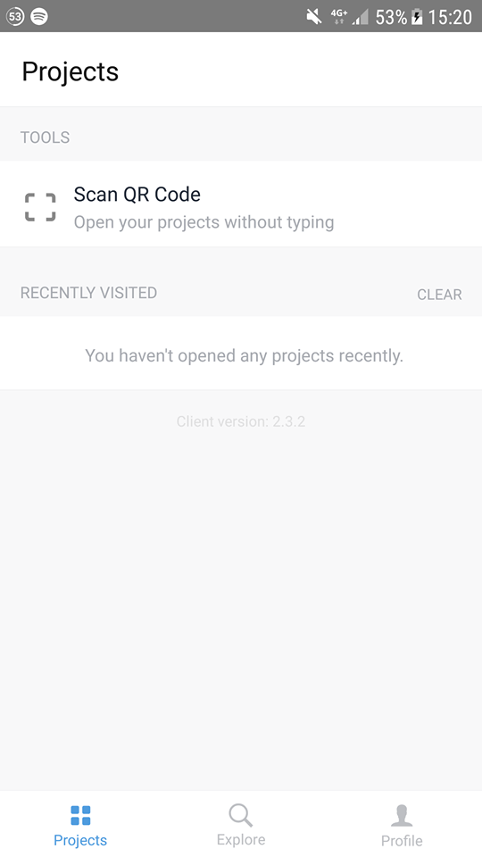

# Dublin Bus App

## About
This is a cross-platform dublin bus app which uses React Native. It was developed by Riain Condon and Shane Daly for their 3rd year project in Dublin City University as part of the Computer Applications degree.

## Installation guide

#### 1. Downloading the Expo Client

##### 1.1 Open either the Google PlayStore (Android) or App Store (iOS).

| *iOS*                | *Android*              |
|:---------------------:|:----------------------:|
| |  |

##### 1.2 Search for "Expo"

| *iOS*                | *Android*              |
|:---------------------:|:----------------------:|
| |  |

##### 1.3 Click the Install (Android) or Get (iOS) button.

| *iOS*                | *Android*              |
|:---------------------:|:----------------------:|
| |  |

#### 2. Downloading Dublin Bus App

##### 2.1 Open <a href="https://exp.host/@daleshaney/dublinbusapp">this</a> link on a separate device.

##### 2.2 Open Expo and open the QR Scanner in Expo.

| *iOS*                | *Android*              |
:---------------------:|:----------------------:|
| | |

##### 2.3 Scan the QR Code on the link you opened on the separate device, Dublin Bus App will open.

| *iOS*                | *Android*              |
|:---------------------:|:----------------------:|
| | 
