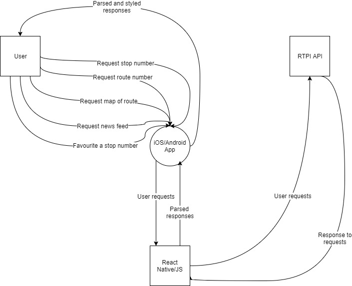

# Dublin Bus App

## CA326 Functional Specification

Riain Condon and Shane Daly

---

# Table of Contents

- [1 Introduction](#1-introduction)

  * [1.1 Overview](#11-overview)

  * [1.2 Business Context](#12-business-context)

  * [1.3 Glossary](#13-glossary)

- [2. General Description](#2-general-description)

  * [2.1 Product / System Functions](#21-product---system-functions)

  * [2.2 User Characteristics and Objectives](#22-user-characteristics-and-objectives)

  * [2.3 Operational Scenarios](#23-operational-scenarios)

  * [2.4 Constraints](#24-constraints)

- [3. Functional Requirements](#3-functional-requirements)

  * [3.1 Search stop number](#31-search-stop-number)

  * [3.2 Search route number](#32-search-route-number)

  * [3.3 Implement favourite stops](#33-implement-favourite-stops)

  * [3.4 Dublin Bus twitter feed](#34-dublin-bus-twitter-feed)

  * [3.5 Offline timetable](#35-offline-timetable)

  * [3.6 Alert when bus is near stop](#36-alert-when-bus-is-near-stop)

  * [3.7 Bus route displayed on Airbnb maps](#37-bus-route-displayed-on-airbnb-maps)

  * [3.8 Filter buses arriving at stop](#38-filter-buses-arriving-at-stop)

  * [3.9 Shops nearby](#39-shops-nearby)

  * [3.10 Current bus location displayed on map](#310-current-bus-location-displayed-on-map)

- [4. System Architecture](#4-system-architecture)

- [5. High-Level Design](#5-high-level-design)

  * [Context Diagram](#context-diagram)

  * [Use Case Diagram](#use-case-diagram)

- [6. Preliminary Schedule](#6-preliminary-schedule)

- [7. Appendices](#7-appendices)

# 1. Introduction

### 1.1 Overview

-----------------

The project is a mobile application which will allow users to track buses with an emphasis on keeping it lightweight and minimal. Our aim is to give users the ability to never miss a bus again.

As both members of the team use Dublin Bus on a regular basis, we have to use the Dublin Bus App. We found it is clunky and difficult to use. It does not satisfy the needs of the user whilst also lacking in basic functionalities. This gave us the idea to reinvent it for the user, by users. We spoke to many users of the current Dublin Bus Application and everyone we spoke to had a handful of issues that they wanted fixed, or they felt should be implemented into a RTPI application. We will take on these suggestions as we go forward with the application.

The UI of the Dublin Bus App is outdated and riddled with bugs, mostly in the RTPI section, which is the most important function. We aim to make it modern, useable and functional, as well as including extra features that users can use for a more enjoyable journey.

The main objective of the application would be to provide a reliable, user friendly experience that serve the needs of people who commute and get the bus every single day. We would like to fix the issue with the current Dublin Bus App, where a bus will randomly vanish off of the app while you are waiting for it to show up, and you are left with no idea when it is going to arrive.

Some other main features of our project will be:

- Rename favourite stops

- Google maps integration with bus stops

- Dublin Bus twitter integrated to the app

- Alerts when a bus is about to arrive at your stop

- Alerts when a bus is almost at the stop you want to get off at

- Offline timetable integration

### 1.2 Business Context

-------------------------

There are two possible business contexts in relation to this product. These contexts are:

- **Sell product to Dublin Bus**

The application could potentially be sold to Dublin Bus. We believe this application would be very suitable as a standalone app for them. When we compare the features we want to add to our application to the ones in the current Dublin Bus App we believe it would be a vast upgrade to the current app. Otherwise they could choose to integrate it with their current application, which could be harder to do but they may decide to use some of our features to upgrade their current app.

- **Deploy application to the Google PlayStore and iOS App Store**

The application could also be deployed onto the PlayStore for Android and the App Store for iOS where it would be a suitable competitor to the the app provided by Dublin Bus. We believe with the features we are adding to our app that we would be able to get people to use our application over the current Dublin Bus App.

The application can be used by all users of public transport, especially students and commuters. Students and commuters would be our primary focus for our testing and target market as they would be the people who would use the app the most.

### 1.3 Glossary

---------------

- **Dublin Bus:**

Bus Operator in Dublin.

- **Route:**

The number displayed at the front of the Dublin Bus.

- **Stop:**

A Dublin Bus bus stop.

- **System:**

Refers to the overall product/system to be developed.

- **Users:**

Refers to the user of the system.

- **API:**

Application Programming Interface.

- **R.E.S.T:**

Representational State Transfer.

---------------

# 2. General Description

### 2.1 Product / System Functions

The main functions that we plan to implement are displayed below. If any ideas are thought of after making this list, we plan on implementing them, if we have time to do so.

- Search stop number

- Search route number

- Implement favourite stops

- Dublin Bus twitter feed

- Offline timetable

- Alert when bus is near stop

- Bus route displayed on Airbnb maps

- Filter buses arriving at stop

- Shops nearby

- Current bus location displayed on map

---

### 2.2 User Characteristics and Objectives

The community that is most likely to benefit from our application is the commuter community. The application is built with this demographic in mind as they are the users who will be using this app day in day out. It will be an integral part of a commuters day as users will be using this getting the bus to work/college and then getting it back home too.

Our objective for the application is to help the lives of commuters by giving them more precise and user friendly app which provides the basic functions of the current Dublin Bus App and gives the user a much more functional app for them to use. We believe this will be achieved with our application. With features such as alerts for when your bus is near, and giving you an offline timetable, we plan to improve our users experiences and life.

---

### 2.3 Operational Scenarios

#### Use cases:

**Scenario 1** Where is my bus?

**Goal in Context**

A user wants to search what time a certain bus will arrive at a stop that they choose

**Description**

1. Open the application.

2. Go to the search tab.

3. Put in your stop number.

4. Get a list of buses that will be showing up at that stop in the next hour.

5. Filter the search for the bus you are looking for.

---

**Scenario 2** My bus did not show up, where is it?

**Goal in Context**

To find out why a bus is not showing up when it says it will.

**Description**

1. Open the application.

2. Go to the news tab.

3. Will be presented with the Dublin Bus twitter feed, who will update it if there is an issue with your bus.

---

**Scenario 3** What stop is the bus I am waiting for at?

**Goal in Context**

To show the user, on Google maps, where their bus currently is, on its route.

**Description**

1. Open the application.

2. Go to the search tab.

3. Put in your stop number.

4. From the list of buses given, click onto the one you want to view.

5. Click view on map.

6. You will be shown what stop the bus is at, on the buses route.

---

**Scenario 4** I want to know when the bus is close to my stop.

**Goal in Context**

The user wants to set a timer, so when the bus is a set amount of time away from their stop, they will be notified by push notification.

**Description**

1. Open the application.

2. Go to the search tab.

3. Put in your stop number.

4. From the list of buses given, click onto the one you want to choose.

5. Click set timer.

6. Set the timer to go off whenever the bus is a specified time away from you stop.

---

**Scenario 5** I do not want to search the same stop every morning I get the bus.

**Goal in Context**

For a user to set a favourite bus, so they do not have to search the stop number regularly.

**Description**

1. Open the application.

2. Go to the search tab.

3. Put in your stop number.

4. From the list of buses given, click onto the one you want to choose.

5. Click set favourite.

6. Set a nickname for that stop

6. Whenever you go onto the application from now on, you will only have to go to your favourites and your stop will be there.

---

### 2.4 Constraints

#### Time Constraints

We will be developing this application under a very tight timeframe. We have to take into account the time spent learning the new technologies to help with the development of the system. Our top priority will be to have our main functionality of the system ready for the presentation and everything else added on after that will be additional features.

#### Integration Requirements

We believe that this application will be in competition for the Dublin Bus Application. With this in mind, we would want to take the users who currently use the Dublin Bus App and have them use our app instead. This would mean there would need to be certain integration requirements we need to look at for users to have a nice and easy crossover to our application.

---------------

# 3. Functional Requirements

### 3.1 Search stop number

- **Description:** In order for a user to see what time a bus will arrive at a stop, they will have to input the stop number into the search field.

- **Criticality:** Searching a stop number is a cornerstone to a bus app. You get on a bus at the bus stop, and without the ability to input the stop number, the app would not work.

- **Technical issues:** We will poll the Dublin Bus API for a list of valid stop numbers that are searchable.

- **Dependencies:** None, this is the first step a user will make when using our system.

---

### 3.2 Search route number

- **Description:** In order for a user to see all stops on a certain buses route, they will have to input the bus number into the search field.

- **Criticality:** As with searching a route number **(3.1)** this function is a cornerstone to the app. For a bus app to function correctly, you will need to be able to know the route a bus goes.

- **Technical issues:** We will poll the Dublin Bus API for a list of valid route numbers that are searchable.

- **Dependencies:** None, the route number will be implemented from the Dublin Bus API.

---

### 3.3 Implement favourite stops

- **Description:** After searching for stop numbers, the user will have the option of adding the stop to a list of their favourites. They will then be able to rename the favourite stop they added to something memorable.

- **Criticality:** Pretty vital, as this function will be one of the main features a user uses. They will have their favourite stops they use everyday, and they will not want to have to search it every time they go to the bus, so they will have them saved in their favourites.

- **Technical issues:** We will use the Async Storage API in React-Native to save the favourites in an asynchronous, persistent, key value system.

- **Dependencies:** This needs the search stop number **(3.1)** to be able to be implemented, as it relies on being able to search a stop, and when you have the stop, a user can add it to their favourites.

---

### 3.4 Dublin Bus twitter feed

- **Description:** Tweets from the Dublin Bus twitter are displayed in a twitter feed implemented in the app. Whenever there is a delay to a bus, they will tweet out the information about it.

- **Criticality:** Very critical. Not all users of Dublin Bus have a twitter account, so whenever Dublin Bus tweet out information, we want to give that information to users of our app, who do not have a twitter account. The feed will provide up to date coverage of what is happening with Dublin Bus and any issues that they might be having.

- **Technical issues:** Getting twitter implemented to our React Native app, alongside all of our RTPI features.

- **Dependencies:** None, this will be implemented externally and will not require other functions to use.

---

### 3.5 Offline timetable

- **Description:** All offline timetables will be displayed in a menu labeled offline timetable as taken from the Dublin Bus website. More specific offline tables will also be available. If you input your stop number you will be able to get an offline prediction as to what time the bus should arrive at your stop.

- **Criticality:** Not all users of this app will have internet while waiting on a bus, with that in mind we believe this make this requirement high priority.

- **Technical issues:** Taking the data from the API and aggregating the average time the bus arrives at the stop at.

- **Dependencies:** None, as this will be implemented by using the external API and aggregated to make the offline timetable.

---

### 3.6 Alert when bus is near stop

- **Description:** If you are on the stop screen, you can choose one of the buses that is coming and set a timer for that bus. So when a bus is, for example, 10 minutes away from the stop, you will get a notification telling you the bus is 10 minutes away.

- **Criticality:** If users know how long it will take them to get to their stop and they use this function, they will be able to accurately know what time they have to leave to get the bus so they do not miss it, which will make this a high priority.

- **Technical issues:** Implementing push notifications to trigger when the bus gets to the time we want it at.

- **Dependencies:** This will rely on searching a stop number **(3.1)**, as you will not be able to use this feature if you are not able to search the stop number that you are waiting on.

---

### 3.7 Bus route displayed on Airbnb maps

- **Description:** After searching a route number you will be given an option to see the bus route on Google maps, with every stop displayed as a pointer.

- **Criticality:** Seeing all the stops on a map can help indicate to a user where they can get on and off a bus, it would make this requirement important for the app.

- **Technical issues:** Current bus stop longitude and latitude values will have to be implemented on top of an Airbnb template.

- **Dependencies:** A route can only be displayed on Airbnb maps if we have the longitude and latitude values for the route we are looking for, which will be able to be found using the search a stop function **(3.2)**.

---

### 3.8 Filter buses arriving at stop

- **Description:** After searching a stop number, the user will be taken into the stop screen which will show all of the buses arriving at the stop. The user will then be presented a menu which will let them pick whatever buses they want to see rather than everything at the stop.

- **Criticality:** For stops with many buses, users will want to make a concise list of the buses they care about, rather than seeing every bus that is showing at the stop.

- **Technical issues:** It is essential that the buses the user decides they want to filter will be the only ones shown on the screen afterwards.

- **Dependencies:** This depends on a user being able to search a stop first, and then from that will have the ability to filter the buses they only want to see.

---

### 3.9 Shops nearby

- **Description:** Once a user is at a stop, the app will recognise how long the bus is away from their current location. If the bus is over a certain time period away from your stop, the app will suggest shops that are close to the stop that you can go to, and will have enough time to get back for the bus.

- **Criticality:** This is one of our main new features we want to implement, but has a lower priority than the basic functionality of the app.

- **Technical issues:** Trying to implement a radius around the bus stop and from that work out if a user will have enough time to get to the shop and back before the bus gets there.

- **Dependencies:** None, will be taken from an external API, which will be show what stops are on the map.

---

### 3.10 Current bus location displayed on map

- **Description:** When looking at a bus on the app, we will give you the ability to see where the bus currently is on the route, using maps.

- **Criticality:** Working out where the bus is will require calculating how far away the bus is and giving the stop where the bus currently resides.

- **Technical issues:** Implementing a feature which can work out the current location of the bus and from the plot the bus on the map, along its route

- **Dependencies:** Will require the knowledge of knowing the bus route on the map **(3.7)** and then get where its current location is to plot it on the map.

---

# 4. System Architecture

## 4.1 iOS App

This is the frontend the user will see while using an iOS device. It will be written in ES6, JSX and some Objective-C using the React-Native Framework and XCode development environment.

## 4.2 Android App

This is the frontend the user will see while using an Android device. It will be written in ES6, JSX and some Java using the React-Native Framework and Android Studio environment.

## 4.3 Dublin Bus API

We will be using the Dublin Bus API which is a RESTful, JSON API which when called on returns information needed for real-time-passenger-information including due times, stop numbers and bus routes etc.

## 4.4 JavaScript Libraries
- React-Native
- AirBnB Maps
- Redux

---

# 5. High Level Design

### Context Diagram

### Use Case Diagram

---

# 6. Preliminary Schedule

## 6.1 Table

## 6.2 Chart

---

# 7. Appendices

* <a href="https://facebook.github.io/react-native/">React Native</a>

* <a href="https://redux.js.org/">Redux</a>

* <a href="https://data.dublinked.ie/dataset/c9df9a0b-d17a-40ff-a5d4-01da0cf08617/resource/4b9f2c4f-6bf5-4958-a43a-f12dab04cf61/download/rtpirestapispecification.pdf">Dublin Bus API</a>

* <a href="https://github.com/airbnb/react-native-maps">AirBnB Maps</a>
