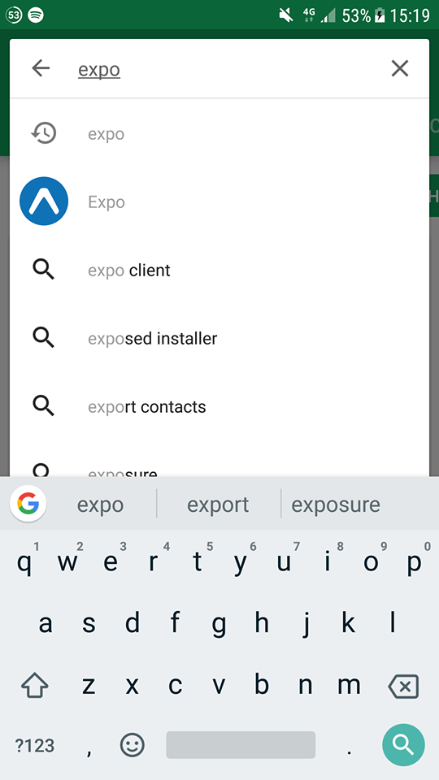
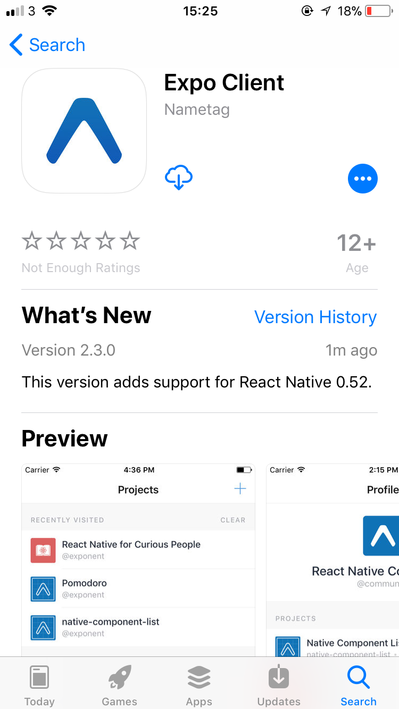
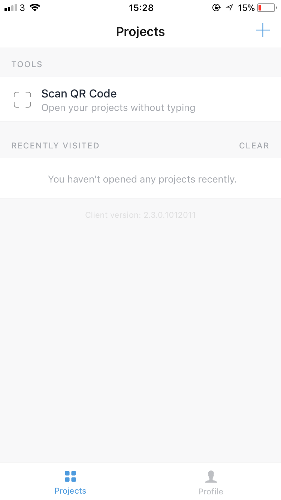

# Dublin Bus App

## CA326 Techical Manual

Shane Daly and Riain Condon

---

# Table of Contents

- [1. Introduction](#1-introduction)
  * [1.1 Overview](#11-overview)
  * [1.2 Glossary](#12-glossary)
- [2. System Architecture](#2-system-architecture)
- [3. High Level Design](#3-high-level-design)
  * [3.1 Component Diagram](#31-component-diagram)
  * [3.2 Data Flow Diagram](#32-data-flow-diagram)
  * [3.3 State Machines](#33-state-machines)
  * [3.4 Sequence Diagrams](#34-sequence-diagrams)
- [4. Problems and Resolutions](#4-problems-and-resolutions)
- [5. Installation guide](#5-installation-guide)
- [6. Future Plans](#6-future-plans)

---

## 1. Introduction

### 1.1 Overview
Dublin Bus App is a cross-platform mobile application implemented with the React-Native framework. The aim of this application is to deliver a lightweight, minimal and improved medium for users to interact with Dublin Bus and their APIs for real time information. We want the user to never miss their bus again and for them to have a more enjoyable experience.

Our application delivers a modern feeling UI which is easy to use and accessible, the UI allows for seamless movement between screens and fluid, responsive interactions with our functions.
The application includes a multitude of features: Adding and nicknaming your favourite stops, all stored locally so there isn't any latency in retrieving them, Searching for real time information of bus stops to see when the next buses are and being able to filter which buses are visible, view nearby shops, view the stops timetable for that stop and also calculate your fare, View route information plotted on a map where you can also view where buses are currently on that route, and finally, be updated with all of the latest news from the Dublin Bus twitter.

As we are using React-Native, the app is coded nearly completely in ES6 and JSX which is bundled into a jsbundle, it is then bridged to the native side using native code from the React library. As a result of this, our app is completely cross platform and uses native UI components on both iOS and Android so the performance is how it would be if it was written in purely native languages.

### 1.2 Glossary

- **Dublin Bus:**
Bus Operator in Dublin.

- **Route:**
The number displayed at the front of the Dublin Bus.

- **Stop:**
A Dublin Bus bus stop.

- **System:**
Refers to the overall product/system to be developed.

- **Users:**
Refers to the user of the system.

- **API:**
Application Programming Interface.

- **React-Native:**
"React Native lets you build mobile apps using only JavaScript. It uses the same design as React, letting you compose a rich mobile UI from declarative components."

- **AsyncStorage:**
"AsyncStorage is a simple, unencrypted, asynchronous, persistent, key-value storage system that is global to the app"

- **Redux:**
"Redux is a predictable state container for JavaScript apps."

- **react-native-google-places:** "iOS/Android Google Places Widgets (Autocomplete, Place Picker) and API Services for React Native Apps"

- **React:** "A JavaScript library for building user interfaces"

## 2. System Architecture

|      |
|:---------------------:|
| |

The "Mobile Device" is the frontend which the user will see either on their iOS or Android device. It is developed using native UI components from the React-Native library and this is how the user interacts with our system.
Our system interacts with several other systems including the Dublin Bus API, Expo, React-Native Packager, Bundler and some dependencies.
Development for each of these systems took place primarily through the React and React-Native libraries, allowing us to use the packagers, bundlers and Expo to build the completed application.

## 3. High Level Design

### 3.1 Component Diagram

|      |
|:---------------------:|
| |

### 3.2 Data Flow Diagram

|      |
|:---------------------:|
|  |

### 3.3 State Machines

| *Shops nearby screen* | *Bus on map*          |
:---------------------:|:----------------------:|
| |  |

### 3.4 Sequence Diagrams

| *Search a stop*           |   *Search a route*        |
:---------------------:|:----------------------:|
|  |  |

## 4. Problems and Resolutions

### Redux:

Redux is a state management tool for JavaScript applications. We decided that we wanted to use redux for our application during the functional specification phase of the project. We wanted to use redux to centralize the states for our application into one. However when we implemented it we got quite a lot of errors when it came to state management. When a user went from the first RTPI screen to the second RTPI screen, the users data would be loaded from the last time they had used it and would not update accordingly. We tried to fix this issue but we were unable to. We decided in the end, to sacrifice redux and instead use navigation to move our props between different screens. This worked instantly and we had no more issues regarding redux after that.

### Shops on the map:

While investigating how to show what shops are around your current location, we found react-native-google-places. It did exactly what we wanted to have our shops on the map to do. You clicked on the shop icon on the RTPI screen and it would come up a search bar. You would then search what you would like around you and then they would all come up on the map. However when they came up on the map, if you tried to move around the map the marker would move and not the map. This was not what we were looking for and we even went onto forums to see if there was a way to fix the marker. There was no way of fixing it, so we decided to go straight to the Google places api, which gave us much better results and overall a better shops on the map functionality.

### Buses not showing on RTPI:

During our project we noticed while using our Dublin Bus app that some buses were not showing up on the RTPI endpoint. We waited a few days to see if it would fix but it did not. We decided to email both Dublin Bus and also The National Transport Agency to let them know about the issue. Dublin Bus never got back to us but The National Transport Agency did and told us they will get in touch with the provider of the RTPI api and should have it fixed by the end of the week. By the following Monday they had fixed it and now we got every bus showing up on the app.

### Promise.all not changing state:

We experienced some problems with our calls to the API on our route screen when trying to use Promise.all and taking the data from that. Although it worked perfectly for our RTPI screen, we came across some errors for setting the state inside of our Promise. This was an error we were stuck on for a while. We ended up finding a way around it by making an async function which we used await inside of it to get the data. This meant for the route screen we were able to set the state of the data we wanted to keep for the rest of the screen.

### React-Native-Prompt outdated

While implementing the favourites function, we needed to use a prompt to allow the user to input a nickname when the favourites button is pressed. After looking for a native implementation of this, we found that we would have to use a third party component for it to work. We found react-native-prompt which seemed to be exactly what we needed, however it hadn't been updated for the newest version of React and React-Native, as a result of this, its use of props and prop styles was outdated. To fix this we researched similar problems online and found another third party component called "prop-types". This fixed the component and allowed us the then complete the prompt.

### AsyncStorage

AsyncStorage is the built-in asynchronous, persistent and unencrypted storage system for React Native. We use this for storing and retrieving the user's favourite stops. When initially implementing the favourites functionality, we ran into multiple problems using AsyncStorage, mostly  surrounding the persistence of data. We found that data could be stored and retrieved fine when the App wasn't closed. In this implementation, we were using an api style system with static functions that would be called on from different classes, however this seemed to be the root of the problem as we couldn't change states of classes affected and hence had no persistence. We re-implemented favourites in RTPISecondScreen and on the FavouritesScreen itself to cater for adding, naming and removing favourites. This completely fixed any previous issues and works perfectly.

### Building iOS App

As we it is a cross-platform application we need to be able to build the app both on iOS and Android. We came into issues with building on iOS as XCode (iOS Development Environment) is only available on macOS. As a result of this, we requested access to iMacs in the school of computing however we also found this to not be an effective solution as all of our dependencies didn't install and we could not sign the app properly. After researching different methods we decided to use a platform called Expo which allows us to bundle our app on any Operating System and then publish it to their hosting service. From this, they compile and host our binaries which are accessible through the Expo Client, a mobile application on Android and iOS. The Expo Client allows us to scan a QR code which instantly installs our app for use. This made user testing and distribution of our app much easier, as well as making development completely wireless and simplifying debugging.

### Expo

When we started to use Expo, we wanted to use icons for our navigation tabs on iOS and to use icons for our buttons on different screens. We found react-native-vector-icons which seemed like a brilliant library, however we found that itself was incompatible with Expo due to rendering differences between React Native and Expo, as a result of this we found Expo's fork of this library and proceeded to use this. We found this to not work either and as Expo had just updated recently we investigated what had changed, the problem ended up being that four lines of code had changed and needed to be reverted for the icons to work. Once we reverted these lines, the problem was solved.

## 5. Installation guide

### 5.1 Prerequisites

 * iOS >= 9.0 OR Android >= 4.4.
 * Camera

### 5.2 Installation Instructions

#### 1. Downloading the Expo Client

##### 1.1 Open either the Google PlayStore (Android) or App Store (iOS).

| *iOS*                | *Android*              |
|:---------------------:|:----------------------:|
| |  |

##### 1.2 Search for "Expo"

| *iOS*                | *Android*              |
|:---------------------:|:----------------------:|
| |  |

##### 1.3 Click the Install (Android) or Get (iOS) button.

| *iOS*                | *Android*              |
|:---------------------:|:----------------------:|
| |  |

#### 2. Downloading Dublin Bus App**

##### 2.1 Open <a href="https://exp.host/@riainc/dublinbusapp">this</a> link on a separate device.

| QR Code                |
|:---------------------:|
| |

##### 2.2 Open Expo and open the QR Scanner in Expo.

| *iOS*                | *Android*              |
:---------------------:|:----------------------:|
| | |

##### 2.3 Scan the QR Code on the link you opened on the separate device, Dublin Bus App will open.

| *iOS*                | *Android*              |
|:---------------------:|:----------------------:|
| | 

---

## 6. Future Plans

  * Access to App without an internet connection, the app would show cached timetables for stops.
  * Implement Alerts system to notify user when their bus is near.
  * Allow user to input how long they will be in a shop.
  * Show stops nearby using the user's device location
