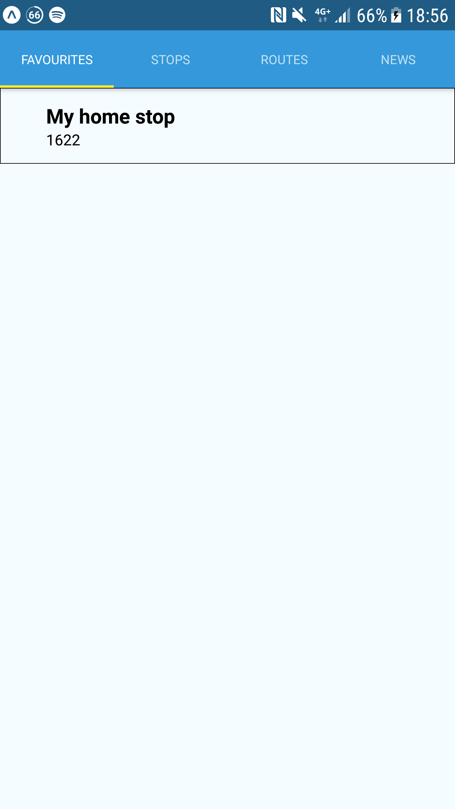
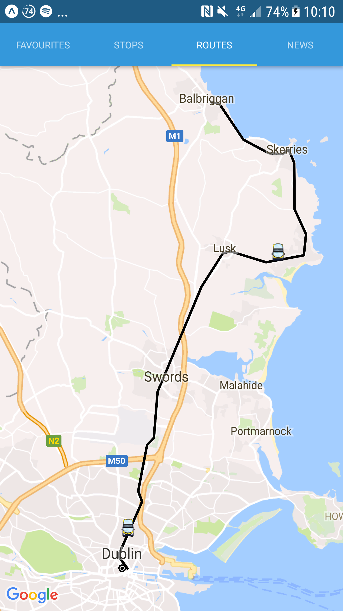

# Dublin Bus App

## CA326 Testing

Shane Daly and Riain Condon

---

# Table of Contents

* [1 Unit testing](#1-unit-testing)
  * [1.0 Jest, Enzyme and Chai](#10-jest-enzyme-and-chai)
  * [1.1 FavouriteScreen](#11-favouritescreen)
  * [1.2 RTPIScreen](#12-rtpiscreen)
  * [1.3 RTPISecondScreen](#13-rtpisecondscreen)  
  * [1.4 RTPIThirdScreen](#14-rtpithirdscreen)
  * [1.5 RTPIFourthScreen](#15-rtpifourthscreen)
  * [1.6 RouteScreen](#16-routescreen)
  * [1.7 RouteSecondScreen](#17-routesecondscreen)
  * [1.8 RouteThirdScreen](#18-routethirdscreen)
  * [1.9 RouteFourthScreen](#19-routefourthscreen)
  * [1.10 FareCalculator](#110-farecalculator)
  * [1.11 FareScreen](#111-farescreen)
  * [1.12 StopTimetable](#112-stoptimetable)
  * [1.13 NewsScreen](#113-newsscreen)
* [2 Pipeline](#2-pipeline)
* [3 User testing](#3-user-testing)
  * [3.1 Cognitive Walkthrough #1 (28/2/2018)](#31-cognitive-walkthrough-#1)
    * [3.1.1 First user (Commuter)](#311-first-user)
    * [3.1.2 Second user (Student)](#312-second-user)
    * [3.1.3 Third user (General public)](#313-third-user)
    * [3.1.4 What we learned](#314-what-we-learned)
  * [3.2 Cognitive Walkthrough #2 (7/3/2018)](#32-cognitive-walkthrough-#2)
    * [3.2.1 First user (Commuter)](#311-first-user)
    * [3.2.2 Second user (Student)](#312-second-user)
    * [3.2.3 Third user (General public)](#313-third-user)
    * [3.2.4 What we learned](#314-what-we-learned)
  * [3.3 User Review Questionnaire Results](#33-user-review-questionaire-results)
* [4 Heuristic evaluation](#4-heuristic-evaluation)
  * [4.1 Strive for consistency](#41-strive-for-consistency)
  * [4.2 Enable frequent users to use shortcuts](#42-enable-frequent-users-to-use-shortcuts)
  * [4.3 Offer informative feedback](#43-offer-informative-feedback)
  * [4.4 Design dialogs to yield closure](#44-design-dialogs-to-yield-closure)
  * [4.5 Offer simple error handling](45-offer-simple-error-handling)
  * [4.6 Permit easy reversal of actions](#46-permit-easy-reversal-of-actions)
  * [4.7 Support internal locus of control](#47-support-internal-locus-of-control)
  * [4.8 Reduce short term memory load](#48-reduce-short-term-memory-load)

---

## 1. Unit testing

### 1.0 Jest, Enzyme and Chai

For our unit testing we decided to use Jest, Enzyme and Chai. Jest is a powerful JavaScript testing library which is used for unit testing and can be integrated with Enzyme. Enzyme is a JavaScript testing utility for React and React Native that makes it easier to assert and traverse your Components' output. The general structure for our unit tests are as follows. We have a 'describe' to describe what we are testing and then we test what 'it' should do for the cases that you set inside your describe.
Chai is an assertion framework for NodeJS, we are using chai-enzyme a library to allow Enzyme to use Chai's assertions and allow for broader testing.

This can be seen in the example below:

We tested each component to see that everything rendered correctly and that the navigation for buttons and lists worked correctly.

| **1.1 FavouriteScreen** | | **1.2 RTPIScreen** | |
|:---------------------:|:----------------------:|:---------------------:|:----------------------:|
|*Unit tests*           | *App screen*           | *Unit tests*           | *App screen*           |
| |  |  |  |

| **1.3 RTPISecondScreen** | | **1.4 RTPIThirdScreen** | |
|:---------------------:|:----------------------:|:---------------------:|:----------------------:|
|*Unit tests*           | *App screen*           | *Unit tests*           | *App screen*           |
| |  |  |  |

| **1.5 RTPIFourthScreen** | | **1.6 RouteScreen** | |
|:---------------------:|:----------------------:|:---------------------:|:----------------------:|
|*Unit tests*           | *App screen*           | *Unit tests*           | *App screen*           |
| |  |  |  |

| **1.7 RouteSecondScreen** | | **1.8 RouteThirdScreen** | |
|:---------------------:|:----------------------:|:---------------------:|:----------------------:|
|*Unit tests*           | *App screen*           | *Unit tests*           | *App screen*           |
| |  |  |  |

| **1.9 RouteFourthScreen** | | **1.10 FareCalculator** | |
|:---------------------:|:----------------------:|:---------------------:|:----------------------:|
|*Unit tests*           | *App screen*           | *Unit tests*           | *App screen*           |
| |  |  |  |

| **1.11 FareScreen** | | **1.12 StopTimetable** | |
|:---------------------:|:----------------------:|:---------------------:|:----------------------:|
|*Unit tests*           | *App screen*           | *Unit tests*           | *App screen*           |
| |  |  |  |

| **1.13 NewsScreen** | |
|:---------------------:|:----------------------:|
|*Unit tests*           | *App screen*           |
| |  |

---

## 2. Pipeline

We decided to use the built-in Continuous Integration tools on GitLab to facilitate our testing and as a second check, ensuring anything we are pushing is passing our tests and is not going to affect existing functionalities and code. To do this, we used the Pipeline. The Pipeline allows us to execute a set of jobs in stages, in this case each job will be executed on push to a branch. The Pipeline uses a Docker environment, in which we chose to use the latest version of Node as the image so we can install yarn, and all of our development dependencies. Then, the testing script will run and execute all of our tests. If our tests pass, the Pipeline will complete and succeed, otherwise the Pipeline will fail and we will be notified, from this we can see what caused our tests to fail and either fix the problem, or revert back to a previous version if the problem cannot be fixed directly.

| Pipeline Images |            
|:------------------------------:|
| *CI Configuration*             |
|       |
| *Pipeline Console*             |
|  |
| *Jobs list*                    |
|     |

---

## 3. User testing

### 3.1 Cognitive Walkthrough #1 (28/2/2018)

| **First set of Cognitive walkthroughs**   |                                                                                                              |
|-------------------------------------------|--------------------------------------------------------------------------------------------------------------|
| ***Date of Evaluation:***                 | 28th February 2018                                                                                           |
| ***Description of System:***              | Dublin Bus App. An application used for by users in conjunction with the bus service provided by Dublin Bus. |
| ***Typical Users:***                      | - Commuters                                                                                                  |
|                                           | - Students                                                                                                   |
|                                           | - General public                                                                                             |
| ***Typical Tasks:***                      | - Search a stop                                                                                              |
|                                           | - Search a route                                                                                             |
|                                           | - Favourite a stop                                                                                           |
|                                           | - Check the shops nearby                                                                                     |
|                                           | - Filter a stop by a bus                                                                                     |
|                                           | - Check Dublin bus twitter                                                                                   |

#### 3.1.1 First user (Commuter)

| Commuter's Actions                    | Outcome successful | Commuter's steps to complete action | Problems occurred | Expert Analysis notes |
|-----------------------------|---------|------|------------------|-----------------------|
| 1. Search a stop            | Yes     | User (after having the term RTPI explained to them), went to the RTPI screen and inputted a stop number. | User was unsure what tab to find searching a stop in, as they did not know what RTPI stood for. | Change RTPI tab to Stops tab for better usability for users. |
| 2. Search a route           | Yes     | User went to the routes screen and inputted a route number. | - | - |
| 3. Favourite a stop         | Yes     | User went to the RTPI screen, searched a stop, clicked the favourite button and named their favourite. | - | - |
| 4. Check the shops nearby   | Yes     | User went to the  RTPI screen, searched a stop, clicked the shops nearby button, picked a shop and got the information about that shop. | - | - |
| 5. Filter a stop by a bus   | Yes     | User went to the  RTPI screen, searched a stop, clicked the filter button and filtered the stop by the bus they chose. | - | - |
| 6. Check Dublin bus twitter | Yes     | User went to news screen and looked through the twitter feed | - | - |

#### 3.1.2 Second user (Student)

| Student's actions                     | Outcome successful | Student's steps to complete action | Problems occurred | Expert Analysis notes |
|-----------------------------|---------|------|------------------|-----------------------|
| 1. Search a stop            | Yes     | User went to the RTPI screen and inputted a stop number. | - | User worked out by deduction where to search a stop from, but was not 100% when looking at the app for the first time. |
| 2. Search a route           | Yes     | User went to the routes screen and inputted a route number. | - | - |
| 3. Favourite a stop         | Yes     | User went to the RTPI screen, searched a stop, clicked the favourite button and named their favourite. | - | - |
| 4. Check the shops nearby   | Yes     | User went to the  RTPI screen, searched a stop, clicked the shops nearby button, picked a shop and got the information about that shop. | - | User mentioned it would be good to have how long it would take to walk there and back and the distance displayed on the shop nearby screen. |
| 5. Filter a stop by a bus   | Yes     | User went to the  RTPI screen, searched a stop, clicked the filter button and filtered the stop by the bus they chose. | - | - |
| 6. Check Dublin bus twitter | Yes     | User went to news screen and looked through the twitter feed | - | - |

#### 3.1.3 Third user (General public)

| General public's actions              | Outcome successful | General public's steps to complete action | Problems occurred | Expert Analysis notes |
|-----------------------------|---------|------|------------------|-----------------------|
| 1. Search a stop            | No      | User did not know where to find searching for a stop.  | User unable to find the tab to search for a stop. | Change RTPI screen to Stops screen. Noted even when user knew where to search a stop, they said they would like a list of all stops underneath the search bar.  |
| 2. Search a route           | Yes     | User went to the routes screen and inputted a route number. | - | User said they would like the stops screen to have a list just like the list under the route screen search bar. |
| 3. Favourite a stop         | Yes     | User went to the RTPI screen, searched a stop, clicked the favourite button and named their favourite. | - | - |
| 4. Check the shops nearby   | Yes     | User went to the  RTPI screen, searched a stop, clicked the shops nearby button, picked a shop and got the information about that shop. | - | User could not tell the difference between the stop and the shop marker on the map because they were both red. Change one to blue for better visibility. |
| 5. Filter a stop by a bus   | Yes     | User went to the  RTPI screen, searched a stop, clicked the filter button and filtered the stop by the bus they chose. | - | - |
| 6. Check Dublin bus twitter | Yes     | User went to news screen and looked through the twitter feed. | - | - |

#### 3.1.4 What we learned

| Commuter | Student | General public |
|----------|---------|----------------|
| * **Change RTPI tab to Stops tab.** | * **Change RTPI tab to Stops tab.**                               | * **Change RTPI tab to Stops tab.** |
|                                 | * **Distance to walk to the shop and time on shops nearby page.** | * **Have list of stops under stops tab like routes tab.** |
|                                 |                                                               | * **Change colour of markers on shops nearby tab for better visibility.** |

---

### 3.2 Cognitive Walkthrough #2 (7/3/2018)

| **Second set of Cognitive walkthroughs** |                             |
|------------------------------------------|-----------------------------|
| ***Date of Evaluation:***                | 7th March 2018              |
| ***Description of System:***             | Dublin Bus App. An application used for by users in conjunction with the bus service provided by Dublin Bus. |
| ***Typical Users:***                     | - Commuters                 |
|                                          | - Students                  |
|                                          | - General public            |
| ***Typical Tasks:***                     | - Search a stop             |
|                                          | - Search a route            |
|                                          | - Favourite a stop          |
|                                          | - Check the shops nearby    |
|                                          | - Filter a stop by a bus    |
|                                          | - Check Dublin bus twitter  |

#### 3.2.1 First user (Commuter)

| Commuter's actions          | Outcome successful | Commuter's steps to complete action | Problems occurred | Expert Analysis notes |
|-----------------------------|---------|------|------------------|-----------------------|
| 1. Search a stop            | Yes     | User went to stops screen and searched for a stop. | - | - |
| 2. Search a route           | Yes     | User went to routes screen and searched for a stop. | - | - |
| 3. Favourite a stop         | Yes     | User went to the stops screen, searched a stop, clicked the favourite button and named their favourite. | - | - |
| 4. Check the shops nearby   | Yes     | User went to the  stops screen, searched a stop, clicked the shops nearby button, picked a shop and got the information about that shop. | - | - |
| 5. Filter a stop by a bus   | Yes     | User went to the  stops screen, searched a stop, clicked the filter button and filtered the stop by the bus they chose. | - | - |
| 6. Check Dublin bus twitter | Yes     | User went to news screen and looked through the twitter feed. | - | - |

#### 3.2.2 Second user (Student)

| Student's actions           | Outcome successful | Student's steps to complete action | Problems occurred | Expert Analysis notes |
|-----------------------------|---------|------|------------------|-----------------------|
| 1. Search a stop            | Yes     | User went to stops screen and scrolled through the list of stops and chose one from that. | - | - |
| 2. Search a route           | Yes     | User went to routes screen and scrolled through the list until they found the route they were looking for. | - | - |
| 3. Favourite a stop         | Yes     | User went to the stops screen, searched a stop, clicked the favourite button and named their favourite. | - | - |
| 4. Check the shops nearby   | Yes     | User went to the  stops screen, searched a stop, clicked the shops nearby button, picked a shop and got the information about that shop. | - | Enjoyed how distance for walking from the stop to the shop and back is displayed on the screen. |
| 5. Filter a stop by a bus   | Yes     | User went to the  stops screen, searched a stop, clicked the filter button and filtered the stop by the bus they chose. | - | - |
| 6. Check Dublin bus twitter | Yes     | User went to news screen and looked through the twitter feed. | - | - |

#### 3.2.3 Third user (General public)

| General public's actions    | Outcome successful | General public's steps to complete action | Problems occurred | Expert Analysis notes |
|-----------------------------|---------|------|------------------|-----------------------|
| 1. Search a stop            | Yes     | User went to stops screen and searched for a stop. | - | Liked how the RTPI tab had been changed to the Stops tab and how there was now a list under the search bar in the Stops tab. |
| 2. Search a route           | Yes     | User went to routes screen and searched for a stop. | - | Mentioned that the list was not sorted numerically and would prefer if it was. |
| 3. Favourite a stop         | Yes     | User went to the stops screen, searched a stop, clicked the favourite button and named their favourite. | - | - |
| 4. Check the shops nearby   | Yes     | User went to the  stops screen, searched a stop, clicked the shops nearby button, picked a shop and got the information about that shop. | - | - |
| 5. Filter a stop by a bus   | Yes     | User went to the  stops screen, searched a stop, clicked the filter button and filtered the stop by the bus they chose. | - | - |
| 6. Check Dublin bus twitter | Yes     | User went to news screen and looked through the twitter feed. | - | - |

#### 3.2.4 What we learned

| Commuter | Student | General public |
|----------|---------|----------------|
| - | * **Liked the distance to walk to the shop on the shops nearby page was implemented.** | * **Liked how the RTPI screen was changed to stops screen.** |
|  |  | * **User would have preferred the route screen list to have a been sorted numerically.** |

---

### 3.3 User Review Questionnaire Results

*Question 1*           | *Question 2*           | *Question 3*
:---------------------:|:----------------------:|:---------------------:
 |  | 

*Question 4*           | *Question 5*           | *Question 6*
:---------------------:|:----------------------:|:---------------------:
 |  | 

*Question 7*           | *Question 8*           | *Question 9*
:---------------------:|:----------------------:|:---------------------:
 |  | 

Questionnaire taken from this link https://docs.google.com/forms/d/1dPMaHbmDk73lJjPc0B8Ipc9WoB9n30il818IO29JJiw/viewform?edit_requested=true

---

## 4. Heuristic evaluation

### Schneiderman's 8 golden rules of interface design

#### 4.1 Strive for consistency

***Consistent sequences of actions should be required in similar circumstances. Identical terminology should be used for prompts, menus, help screens.***

We wanted to make the app as simple and easy to use as possible for users. For this, we made sure that we gave the names of our screens to be ones that users will be able to understand and also to have a colour scheme which is consistent throughout the app. We also used the same types of components on each screen so we could give the user a consistent experience while using all areas of the application.

|           |            |           |             |
|:---------------------:|:----------------------:|:---------------------:|:---------------------:|
|  |  |  |  |

#### 4.2 Enable frequent users to use shortcuts

***Shorter response times are attractive for frequent users and should be made available.***

We designed the application with the aim to please users who would use the app every single day and also users who would use the app once or twice a month. To give users shortcuts, we added a favourites screen, so that users who go to the same stop every single day, do not have to search the route every time they want to go to it.

|            |           |             |
:---------------------:|:----------------------:|:---------------------:|
 |  |  |

#### 4.3 Offer informative feedback

***For every operator action there should be feedback. This can be modest for a frequent or minor action. For infrequent or major actions the response should be more substantial.***

Users will get feedback if they try to connect to the app and they have no internet connection. They will also get feedback if there are no buses at the current stop they are searching for.

|            |           |
:---------------------:|:----------------------:|
 |  |

#### 4.4 Design dialogs to yield closure

***Actions should be organised to have a beginning, a middle, and an end, like a good short story. The informative feedback at the end enables closure to take place so the user knows they are free to move onto the next stage.***

We designed our buttons to give users a beginning, a middle and an end. We wanted to do it this way so the users would be able to understand what they are doing and show the stages that are present for using the features of our app. We set it up so the beginning would be whatever button a user clicks, the middle would be the settings that you click to be able get the desired result you are looking for and the end to be the screen with the information the user set out to get when they clicked the button in the beginning.

|     Beginning        |       Middle     |     End         |
:---------------------:|:----------------------:|:---------------------:
 |  |  |

#### 4.5 Offer simple error handling

***The possibilities for error should be designed out of the system wherever possible. The user should be offered a simple comprehensible mechanism for handling error. Erroneous commands, that is commands that do not mean anything to the system, should leave the system unchanged.***

As our application is dealing with users inputting numbers to get a stop, we had error handling if a user inputted a wrong stop number that they would be shown an alert which let the user know it was not a valid stop.

|            |
:---------------------:|
 |

#### 4.6 Permit easy reversal of actions

***Actions should be reversible. This relieves anxiety since the user knows that errors can be undone. It also encourages exploration because users know that any action can be easily reversed.***

Our application uses stack navigation. We decided to use stack navigation so if users decided they made an incorrect move and they want to redo what they just did that it is possible by hitting the back button. This will put users back to the step they were at before they made the mistake.

#### 4.7 Support internal locus of control

***Experienced operators like to know they are in charge of the system. Users should initiate actions rather than being on the receiving end of them.***

Users are the ones who run the application. They are in control of what the application does. They can put in whatever stop number they want and see the shops nearby, they can check whatever buses are on the map and they can even check the Dublin Bus twitter from inside the app.

#### 4.8 Reduce short term memory load

***Displays should be simple, sufficient training time should be allowed, multiple page displays should be consolidated if possible.***

As with the strive consistency, we made the app as simple as possible, so that users are able to understand the app and be able to use it with ease.
